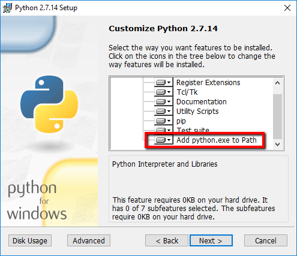
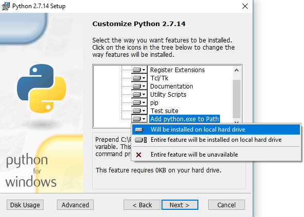

# Installing the MkDocs Toolset

MkDocs is a Markdown documentation generator we’ll be using in class. It requires a few tools to be installed before we get started, described next.

For the most part, all of these tools are cross-platform and can be used on Windows or Mac. The instructions here explain the Windows methods, but each website will have specific installation instructions for each operating system.

## Python
MkDocs is written in Python, which is a common programming language. We won’t actually do anything with Python, but MkDocs needs it to work. 

Python doesn’t exist by default on Windows systems, so we have to install it ourselves.

!!! note
    We’re installing the current 2.x release, not the 3.x release.

### Install Python 2.7

1. Go to the [Python download page](https://www.python.org/downloads)
1. Click **Download Python 2.7.14**.

    The `.msi` installer file will be downloaded onto your machine.

1. In the *Customize Python 2.7.14 dialog*, scroll to the bottom option and select **Add python.exe to Path**.
    A dropdown list of options appears.

    

1. Click on **Will Be Installed to Local Hard Drive**.

    

    !!! important
        This is an easy step to miss, and mkdocs won't work if you skip it.

1. Continue with the installer and click **Finished** when done.
1. Close the installer.

### Verify Python Installation

**To verify that Python was installed correctly and added to the system Path:**

1. Open a windows command prompt
1. In Windows 10, click the magnifying glass at the left side of the menu bar
1. Type `cmd` in the search text box and press **enter**.
   The windows command prompt window will open.
1. Type `pip` at the  prompt and press **enter**.
   The terminal window should fill up with a long list of commands and arguments. You don’t need to know what these do; if you see them, it means installation was successful.

   **If you get an error message** (similar to “pip is an unknown command” or “pip not found on system path”), then Python wasn’t installed correctly. Most likely, this means that step 4 wasn’t followed correctly during installation.

If this test fails, you won’t be able to install or run MkDocs. If that happens, re-run the Python installer, choose Change (not repair or uninstall) from the installer menu, and repeat the Python [installation procedure](#install-python-2.7).

## Visual Studio Code
Visual Studio Code is a code editor normally used for programming and development. We’re going to use it as our text editor here for a couple of reasons: it’s very lightweight and easy to learn, it has an integrated command terminal window for convenience, and it understands multi-file projects like the ones we’re going to create using MkDocs.

It’s worth noting, though, that the files used in MkDocs (and markdown in general) are just plain text files even though they have odd extensions like .yml and .md. You don't need an elaborate editor to write markdown -- you could just as easily do all of this work using Notepad.

### Install Visual Studio Code

1. Go to Microsoft's [Visual Studio Code](https://code.visualstudio.com) page.
1. Click **Download for Windows** (or, if you’re at home on another OS, choose the appropriate alternate download)
1. Run the installer.
1. When the installer completes, start Visual Studio Code.

    The application opens and a Welcome tab displays.

1. Click **ctrl** + **`** (backtick) to open a command prompt window.

### Set the Default Shell
The default command prompt tool (you’ll sometimes see this called the *shell*) is *Windows PowerShell*; we want to use the **Windows Command Prompt** instead. 

**To set the default terminal shell:**

1. Press **Ctrl** + **Shift** + **P** to open the Visual Studio Code command palette. 
    
1. Type `shell` in the text box, and select the option for changing the default terminal shell.

    

1. Select command prompt from the dropdown list.

    

1. Close and restart Visual Studio Code.

!!! tip
    The first time you open the terminal in Visual Studio Code, an alert will drop in at the top of the window that allows you to easily change the default shell. Click the **Customize** button in the alert then select **Command Prompt** from the dropdown list.

### Set the Visual Studio Code Theme

The default color scheme for Visual Studio Code shows white text on a dark background; if you’d rather see black text on a white background, or an entirely different color scheme, go to **File** > **Preferences** > **Color Theme** and choose a theme you like.

## MkDocs

MkDocs is at the engine at the heart of this markdown-based documentation project. It converts all of your markdown files to HTML, builds the navigation, and packages up all the files for distribution. 

### Install MkDocs

1. If the command prompt isn’t still open in Visual Studio Code, open it by pressing ctrl + `.
1. Type pip install mkdocs and press enter.
    Pip will download and install the required dependencies.

### Install the MkDocs Material Theme

1. In the terminal window, type pip install mkdocs-material and press enter.
    Pip will download and install the required dependencies.
 